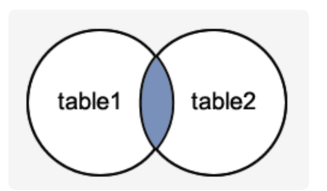
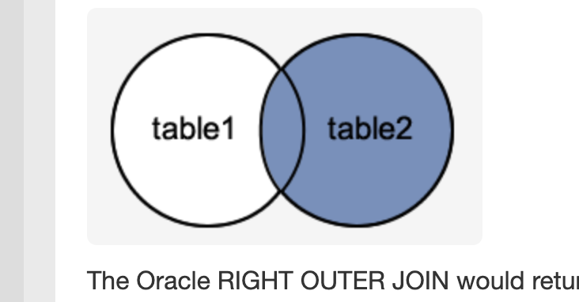
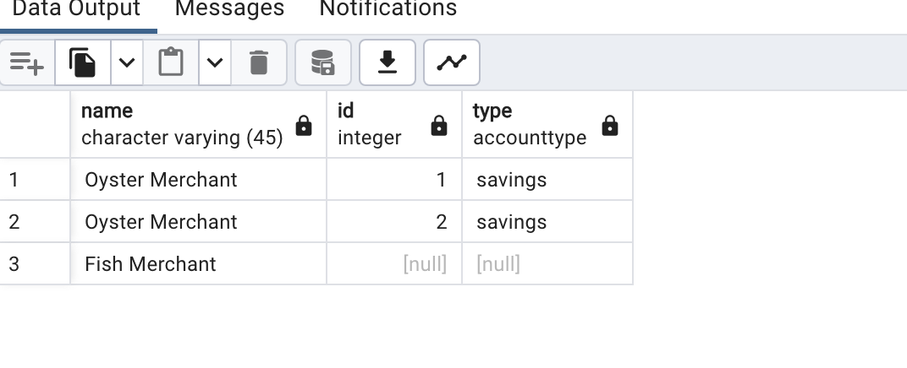

```
CREATE DATABASE bank;
CREATE SEQUENCE bankuser_id MINVALUE 1 START WITH 1
INCREMENT BY 1
CACHE 10;
create table bankuser(
name varchar(45),
id int primary key
);
insert into bankuser(name,id) values ( 'Oyster Merchant',nextval('bankuser_id'));
insert into TABLE_NAME(COL1, COL2) values (v1,v2);
select * from bankuser;
delete from bankuser where name like '%Fish%';
delete from bankuser where name ILIKE '%Fish%'; -- case insensitive
alter table bankuser add column address varchar(100);
alter table bankuser alter column address set DEFAULT 'Hyderabad';
update bankuser set address = 'Hyderabad' where address is NULL;

ALTER TABLE table_name DROP COLUMN column1, column2….;   


-- INNER JOIN (simple join)

--- only common elements will be picked.

select name , account.id , account.type from bankuser, account where bankuser.id = account.owner;
select name , account.id , account.type from bankuser inner join account on  bankuser.id = account.owner;
---- ( [-)(-] ) imagine 2 intersecting venn diagram it is ====== A n B == inner join.

---- if we want all the tables values from 1st table and null values for those that dont match in the
-- right side then its called the LEFT OUTER JOIN  A U (A n B) is left outer join

select name , account.id , account.type from bankuser inner join account on  bankuser.id = account.owner;


```
<div>
<div>
<h2 >inner join</h2>
</img>
</div>
<div>
<h2 >right outer join</h2>
</img>
</div>
<div>
<h2 >left outer join result</h2>
</img>
</div>

</div>

<h2>What is PL/SQL</h2>
<div>
PL/SQL is a procedural language. its tightly coupled 
with Oracle database, it has support for IF-THEN-ELSE,
CASE, FOR loops , WHILE and GOTO. It also allows us to make 
procedural blocks
    Why we need PL/SQL?
    <li>Efficient Data processing, faster in db,  </li>
    <li>Modular and Reusable Code aka : stored procedures, functions</li>
     <li>Robustness and Security</li>
</div>


<div>
<h2>Mysql Engines</h2>
<ul>
<li>ISAM is mostly obselete</li>
<li>Inno DB, inno db is a default choice for MySQL, has transaction support, uses <a href="https://www.geeksforgeeks.org/introduction-of-b-tree-2/"> B trees</a> for indexing </li>

<li>MyRocks, developed by Facebook, for fastrer writes key -value based </li>
<li>TokuDB, large volume of data, improved  compression and fast inserts </li>
<li> uses Fractal Trees index for effient data storage</li>
</ul>
Some notes on <b>B Tree</b>, B Tree are self balancing trees. they have a degree of fanning out. each node has t-1 keys minimum.
and t children.
B Tree offer log(n) search and insert times.

Some notes of fractal trees. Fractal trees are good for representing data that are self-similar, example
internet network, if you look at all of the network or some part of the network some characteristics are same.
It looks the same. Another example is a beach. if you look at all of the beach it will appear sandy, grainy, even if you 
look at some part of it ..like when u zoom it still looks the same.


Social-network, geographic locations, road networks are some places where fractal trees can be used.

Fractal trees are  basially trees having recursive structure, but little bit of randomness.. 

Used for fast approximate queries. where exact ans is not requried just nearest neighbhours.<br/>
"**Image Retrieval:** In a large image database, finding an exact replica of a specific image might not be necessary. A user might be looking for similar images."

"**Medical Diagnosis**:  In some medical applications, like anomaly detection in X-rays or MRIs, a perfect match to a known disease pattern might not be necessary. A fractal tree can be used to identify regions in an image that deviate significantly from the norm, potentially indicating areas for further investigation by a doctor."

**"Fraud Detection:** Fraudulent transactions in financial data often exhibit similar patterns."
In these scenarios, fast detection is required than exact. 

</div>


